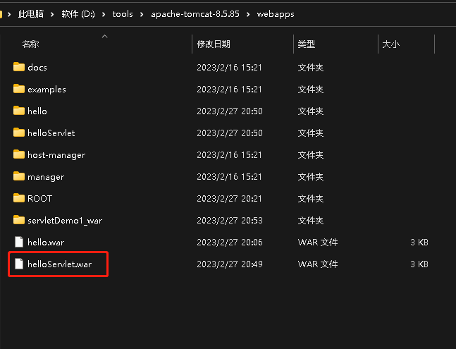
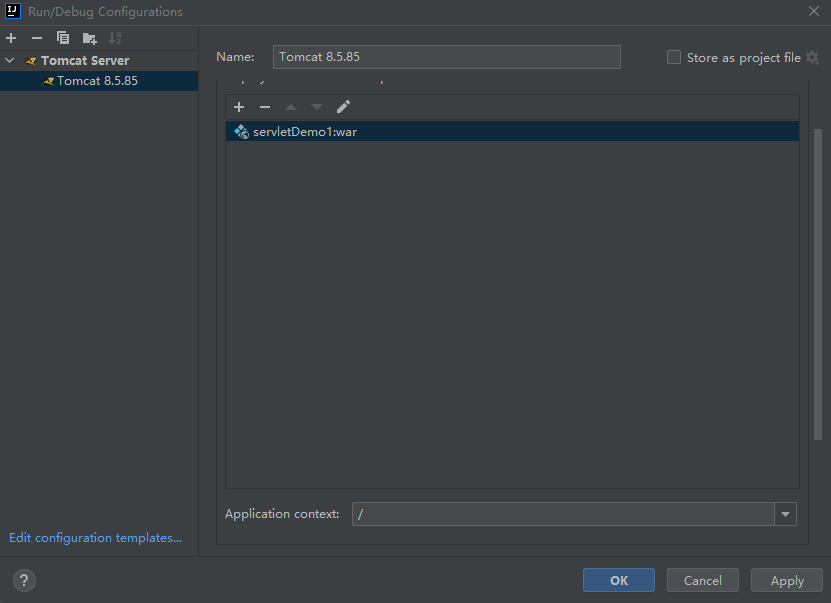
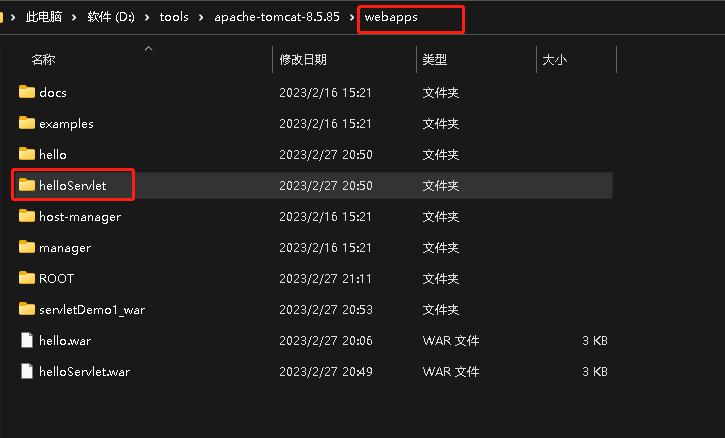

### Java servlet hello world

参考[使用Servlet写一个hello world](https://blog.csdn.net/qq_52988578/article/details/123612741) 描述了一个最简单的servlet程序
创建过程，到部署到tomcat应用目录

启动方式1
1. 手动拷贝war包到tomcat/webapps/目录下

2. 运行D:\tools\apache-tomcat-8.5.85\bin\startup.bat 启动tomcat

3. 浏览器访问 localhost:8080/helloServlet

启动方式2
1. 在IDEA 里添加tomcat启动方式

2.

idea 里通过解压war包内容到webapps 目录
