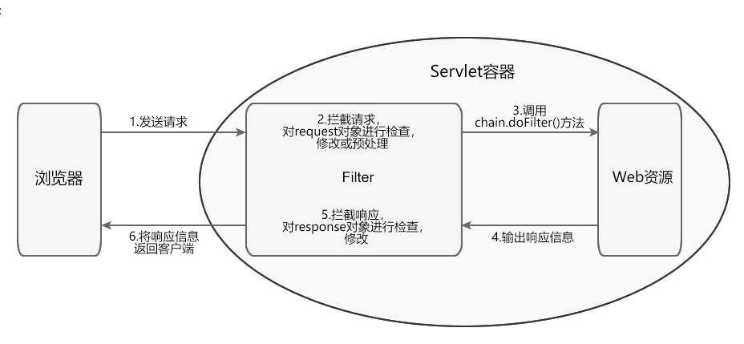

Servlet Filter 过滤器

#### Filter 的工作流程

* 客户端请求访问容器内的 Web 资源。
* Servlet 容器接收请求，并针对本次请求分别创建一个 request 对象和 response 对象。
* 请求到达 Web 资源之前，先调用 Filter 的 doFilter() 方法，检查 request 对象，修改请求头和请求正文，或对请求进行预处理操作。
* 在 Filter 的 doFilter() 方法内，调用 FilterChain.doFilter() 方法，将请求传递给下一个过滤器或目标资源。
* 目标资源生成响应信息返回客户端之前，处理控制权会再次回到 Filter 的 doFilter() 方法，执行 FilterChain.doFilter() 后的语句，检查 response 对象，修改响应头和响应正文。
响应信息返回客户端。

#### Filter 的生命周期
Filter 的生命周期分为 3 个阶段： 初始化阶段、拦截和过滤阶段、销毁阶段
1. 初始化阶段
   Servlet 容器负责加载和实例化 Filter。容器启动时，读取 web.xml 或 @WebFilter 的配置信息对所有的过滤器进行加载和实例化。
加载和实例化完成后，Servlet 容器调用 init() 方法初始化 Filter 实例。在 Filter 的生命周期内， init() 方法只执行一次。

2. 拦截和过滤阶段
   该阶段是 Filter 生命周期中最重要的阶段。当客户端请求访问 Web 资源时，Servlet 容器会根据 web.xml 或 @WebFilter 的过滤规则进行检查。当客户端请求的 URL 与过滤器映射匹配时，容器将该请求的 request 对象、response 对象以及 FilterChain 对象以参数的形式传递给 Filter 的 doFilter() 方法，并调用该方法对请求/响应进行拦截和过滤。

3. 销毁阶段
   Filter 对象创建后会驻留在内存中，直到容器关闭或应用被移除时销毁。销毁 Filter 对象之前，容器会先调用 destory() 方法，释放过滤器占用的资源。在 Filter 的生命周期内，destory() 只执行一次。

#### DEMO
demo 实现get 请求时候根据用户名模拟检查登录， 实习那对用户未登录请求进行拦截