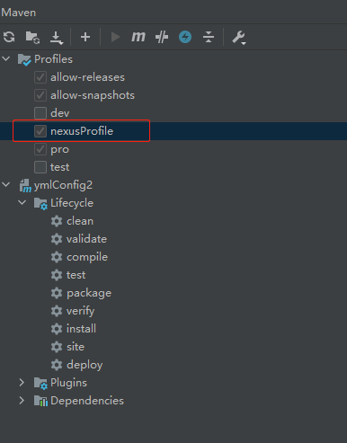

### springboot 多环境yml 配置文件激活

展示了多环境配置的选择， 在打包时候maven插件会根据选中的环境替换yml 里的@env@ 实现激活

参考：
[Spring与Maven多环境配置](https://blog.csdn.net/AngerWind/article/details/105078769)
[Springboot的默认配置文件和外部配置文件及加载顺序](https://blog.csdn.net/qq_41946216/article/details/124816948)