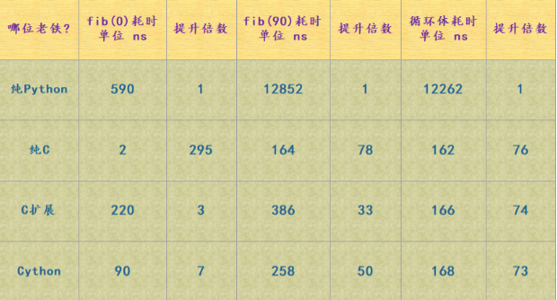
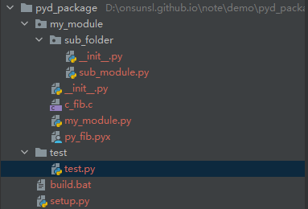
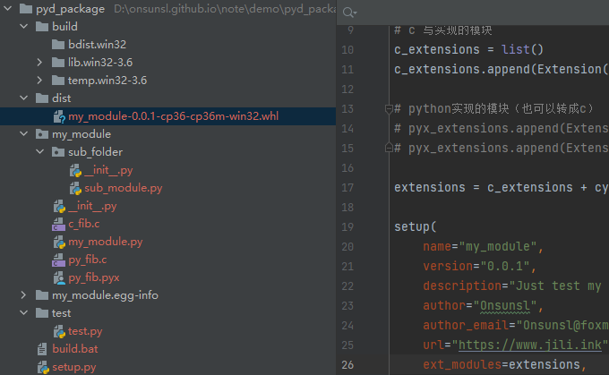

## 初识Cython
### 1.背景
Python cpu运算速度慢，没法使用多线程，没法使用多核cpu, 解决方案有cython、pypy、ctypes、cffi等等, 有没有语法想python一样，而且又有C的语言，
有，那就是cython， 注意不是cpython(python解释器的c源码)

### 2.概念
* Cython 是一门编程语言， 它结合了C 和 Python 的有点的一门编程语言， 代码语法高度像python, 类型高度贴于与C；
* Cython 是一个编译器，它Cython 代码编译成了Python 可用的类库，准确的说是先把cython语言编译c,再编译从python可加载的模块；

> .pxi 文件include files
> .pxd 文件类似于 C 语言的 .h 头文件,  声明文件，d代表declaration，用于包含提Cython模块, 可用 cimport 关键字将 .pxd 文件导入
> .pyx 文件类似于 C 语言的 .c 源代码文件implementation file，.pyx 文件中有 Cython 模块的源代码
> .pyd 文件是编译后的Cython 动态库，实际上是在 .pyd 文件中封装了一个 module， python 在使用的直接import pyd文件名即可
> .pyi 文件 可以理解为是做接口类型检查支持的文件， 参考PEP484

* 举例

> 基于 Qt/C++ 的 PyQt、PySide GUI (图形用户界面) 开发框架绑定，会为每个 Qt/C++ 库 .dll 文件生成一个中间 .pyd 文件。
> PyWin32 项目分发包中， 也存在很多 MicroSoft Windows OS 相应 .dll 文件的中间 .pyd 文件。

* 语法

学习cython 需要有C的基础， 语法参考[官方文档](https://cython.readthedocs.io/en/latest/) 和
[《Cython系列》](https://www.cnblogs.com/traditional/p/13196509.html)

 

### 3.C/C++ 工具链安装
根据python 的版本下载对应的VS tool 编译工具（VS 全量安装也可以）, 查看Python 版本信息, 1900对应VS2015

```shell
$ python
Python 3.6.6 (v3.6.6:4cf1f54eb7, Jun 27 2018, 02:47:15) [MSC v.1900 32 bit (Intel)] on win32
Type "help", "copyright", "credits" or "license" for more information.

```

[VS2015 build tools下载地址](https://my.visualstudio.com/Downloads?q=visual%20studio%202015&wt.mc_id=o~msft~vscom~older-downloads)

### 4.Cython Demo
使用pyx 实现斐波那契数列的demo, `fib.pyx` 源码文件

```python
def fib(int n):
  cdef int i
  cdef int a=0, b=1
  for i in range(n):
    a, b = a + b, a
  return a
```


编译安装脚本`setup.py`

```python
from distutils.core import setup, Extension
from Cython.Build import cythonize

ext = Extension(name="fib", sources=["fib.pyx"])
setup(ext_modules=cythonize(ext))
```


运行编译
```shell
$ python setup.py build_ext --inplace
Compiling fib.pyx because it changed.
[1/1] Cythonizing fib.pyx
D:\Program Files (x86)\Python36-32\lib\site-packages\Cython\Compiler\Main.py:369: FutureWarning: Cython directive 'language_level' not set, using 2 for now (Py2). This will change in a later release! File: D:\workspace\cpos-df\fib.pyx
tree = Parsing.p_module(s, pxd, full_module_name)
running build_ext
building 'fib' extension
error: Unable to find vcvarsall.bat
fib.c
C:\Program Files (x86)\Microsoft Visual Studio 14.0\VC\BIN\link.exe /nologo /INCREMENTAL:NO /LTCG /DLL /MANIFEST:EMBED,ID=2 /MANIFESTUAC:NO "/LIBPATH:D:\Program Files (x86)\Python36-32\libs" "/LIBPATH:D:\Program Files (x86)\Python36-32
\PCbuild\win32" "/LIBPATH:C:\Program Files (x86)\Microsoft Visual Studio 14.0\VC\LIB" "/LIBPATH:C:\Program Files (x86)\Windows Kits\10\lib\10.0.10240.0\ucrt\x86" "/LIBPATH:C:\Program Files (x86)\Windows Kits\8.1\lib\winv6.3\um\x86" /EX
PORT:PyInit_fib build\temp.win32-3.6\Release\fib.obj /OUT:D:\workspace\cpos-df\fib.cp36-win32.pyd /IMPLIB:build\temp.win32-3.6\Release\fib.cp36-win32.lib
Creating library build\temp.win32-3.6\Release\fib.cp36-win32.lib and object build\temp.win32-3.6\Release\fib.cp36-win32.exp
Generating code
Finished generating code
```

输出文件fib.cp36-win32.pyd  这个是c编译后的文件，其实是DLL文件，但是改成xxx.dll 无法正常调用, 主要是加载问题。 测试程序
`fib_demo.py` 用来测试模块

```python

import fib

print(fib.fib(1000))
```

Python、纯C、C扩展、Cython 的性能对比




### python & cython & c extent 混合 PK

分别使用Python、cython 和 c 拓展方式实现一个斐波那契数列，并打包输出wheel包, 顶层模块my_module, 代码目录结构如图：



#### python 版本

my_module/my_module.py
```python
from my_module.sub_folder import sub_module

def hello() -> None:
    print("hello " + sub_module.world())

def py_fib(n: int) -> int:
    a, b = 0, 1
    for _ in range(n):
        a, b = a + b, a
    return a

if __name__ == '__main__':
    hello()
```

my_module/sub_folder/sub_module.py

```python
def world() -> str:
    return "world"
```


#### cython 版本
```python
def fib(int n):
    cdef int i
    cdef int a=0, b=1
    for i in range(n):
        a, b = a + b, a
    return a
```

#### c 拓展版本


```c
//
// Created by guanglin.liang on 2022/6/2.
//
#include<Python.h>

// c_fib 方法实现
static PyObject * c_fib(PyObject *self, PyObject *args) {

    long n;
    // 提取参数转成long 赋给n
    if (!PyArg_ParseTuple(args, "l", &n)) {
        PyErr_Format(PyExc_ValueError, "参数需要long类型, 而不是 %s", Py_TYPE(n) -> tp_name);
        return NULL;
    }
    long i;
    long a = 0, b = 1, tmp;
    for (i = 0; i < n; i++){
        tmp = a; a = a + b; b = tmp;
    }
    return Py_BuildValue("l", a);
}

// python 模块方法结构
// {name, method, flags, doc}
// 即 {名称，包装函数，哪种argument形式如METH_VARARGS 和 METH_KEYWORDS， 描述}
// c_fib模块方法声明
static PyMethodDef  c_fibMethods[] = {
        {"c_fib", c_fib, METH_VARARGS, "这个是c_fib"},
        {NULL, NULL, 0, NULL} // 以 NULL 作结
};

// python 模块结构
// {base, name, doc, size, module methods 表}
// 即 {PyModuleDef_HEAD_INIT, 名字， 描述， 分配内存大小， module 方法列表}
// c_fib 模块结构声明
static struct PyModuleDef c_fib_module = {
        PyModuleDef_HEAD_INIT,
        "c_fib",
        "这个是用C实现的fib模块.",
        -1, // global state
        c_fibMethods
};


// import c_fib 时会调用必须以PyInit_开头
PyMODINIT_FUNC PyInit_c_fib(){
    return PyModule_Create(&c_fib_module);
}
```

#### 打包&编译
```python
from setuptools import setup
from setuptools import Extension
from Cython.Build import cythonize

# cython 实现的模块
pyx_extensions = list()
pyx_extensions.append(Extension("my_module.pyx_fib", ["my_module/py_fib.pyx"]))

# c 写实现的模块
c_extensions = list()
c_extensions.append(Extension("my_module.c_fib", ["my_module/c_fib.c"]))

# python实现的模块（也可以转成c）
# pyx_extensions.append(Extension('my_module', ['my_module/my_module.py']))
# pyx_extensions.append(Extension('sub_folder.sub_module', ['my_module/sub_folder/sub_module.py']))

extensions = c_extensions + cythonize(pyx_extensions, compiler_directives={'language_level': 2})

setup(
    name="my_module",
    version="0.0.1",
    description="Just test my package",
    author="Onsunsl",
    author_email="Onsunsl@foxmail.com",
    url="https://www.jili.ink",
    ext_modules=extensions,
    packages=["my_module", "my_module.sub_folder"],
)
```

```shell

>python setup.py --help-commands
Compiling my_module/py_fib.pyx because it changed.
[1/1] Cythonizing my_module/py_fib.pyx
Standard commands:
  build             build everything needed to install                          编译全部
  build_py          "build" pure Python modules (copy to build directory)
  build_ext         build C/C++ extensions (compile/link to build directory)    编译扩展模块
  build_clib        build C/C++ libraries used by Python extensions
  build_scripts     "build" scripts (copy and fixup #! line)
  clean             clean up temporary files from 'build' command               编译并安装到python环境site-packages
  install_lib       install all Python modules (extensions and pure Python)
  install_headers   install C/C++ header files
  install_scripts   install scripts (Python or otherwise)
  install_data      install data files
  sdist             create a source distribution (tarball, zip file, etc.)
  register          register the distribution with the Python package index
  bdist             create a built (binary) distribution
  bdist_dumb        create a "dumb" built distribution
  bdist_rpm         create an RPM distribution
  bdist_wininst     create an executable installer for MS Windows               打包成.exe的安装包
  bdist_msi         create an MS installer for MS Windows                       打包成.msi的安装包
  check             perform some checks on the package
  upload            upload binary package to PyPI

Extra commands:                                                                 这些是wheel包扩展的
  bdist_wheel       create a wheel distribution                                 打包.whl格式的包
  alias             define a shortcut to invoke one or more commands
  bdist_egg         create an "egg" distribution
  develop           install package in 'development mode'
  dist_info         create a .dist-info directory
  easy_install      Find/get/install Python packages
  egg_info          create a distribution's .egg-info directory
  install_egg_info  Install an .egg-info directory for the package
  rotate            delete older distributions, keeping N newest files
  saveopts          save supplied options to setup.cfg or other config file
  setopt            set an option in setup.cfg or another config file
  test              run unit tests after in-place build (deprecated)
  upload_docs       Upload documentation to sites other than PyPi such as devpi

usage: setup.py [global_opts] cmd1 [cmd1_opts] [cmd2 [cmd2_opts] ...]
   or: setup.py --help [cmd1 cmd2 ...]
   or: setup.py --help-commands
   or: setup.py cmd --help

```
运行`python setup.py bdist_wheel` 编译并打包，输出到dist目录下



测试程序
```python
import time

from my_module import my_module, c_fib, pyx_fib

def fib_test():

    my_module.hello()
    n = 10000
    m = 1000

    begin = time.time()
    for _ in range(m):
        r = pyx_fib.fib(n)
    print("pyx_fib.fib() cast:{}S".format(time.time() - begin))

    begin = time.time()
    for _ in range(m):
        r = c_fib.c_fib(n)
    print("c_fib.fib() cast:{}S".format(time.time() - begin))

    begin = time.time()
    for _ in range(m):
        r = my_module.py_fib(n)
    print("my_module.py_fib cast:{}S".format(time.time() - begin))

    print("the end")
if __name__ == '__main__':
    fib_test()
```

运行错误, 是因为pycharm 里识别了本地源码的目录导致， 使用cmd运行即可
```shell
C:\Users\guanglin.liang\pythonEnv\withPdbInfo\Scripts\python.exe D:/onsunsl.github.io/note/demo/pyd_package/test/test.py
Traceback (most recent call last):
  File "D:/onsunsl.github.io/note/demo/pyd_package/test/test.py", line 3, in <module>
    print(my_module.my_module.hello())
AttributeError: module 'my_module' has no attribute 'my_module'
```

fib输出, 可以看出cython 和c 基本一样，而python 确实非常耗时
```shell
hello world
pyx_fib.fib() cast:0.007981300354003906S
c_fib.fib() cast:0.008492708206176758S
my_module.py_fib cast:24.008681297302246S
the end
```

动态加载pyd
打包后的程序也可以动态导入模块， 优先导入fib.pyd 后fib.py

测试动态导入
```python
import importlib

def run():
f = importlib.import_module("fib")
print(f.fib(1000))

if __name__ == '__main__':
run()
```


### FAQ
* .pyd 能破解吗？
  pyd其实是DLL, DLL都能破解，所有pyd也可以 [python编译后的pyd爆破](http://www.wangqingzheng.com/yunweipai/25/39525.html#)


* .pyd 的dll 吗？
  是,  使用`dll depends` 查看pyd, 跟dll一样的


* 测试导入异常: ImportError: attempted relative import with no known parent package
  my_module 内部包结构要不能使用相对目录导入


### 参考
1. [Python的.py与Cython的.pxd.pyx.pyd 文件格式之间的主要区别](https://blog.csdn.net/weixin_36670529/article/details/113733714)
2. [《Cython系列》](https://www.cnblogs.com/traditional/tag/Cython/)
3. [Python的打包工具(setup.py)实战篇](https://www.cnblogs.com/yinzhengjie/p/14124623.html)
4. [Python与C语言扩展](https://juejin.cn/post/6844903865079332871)
5. [Extending Python with C or C++](https://docs.python.org/3/extending/extending.html)
6. [一起调试 Python 和 C++](https://docs.microsoft.com/zh-cn/visualstudio/python/debugging-mixed-mode-c-cpp-python-in-visual-studio?view=vs-2022)